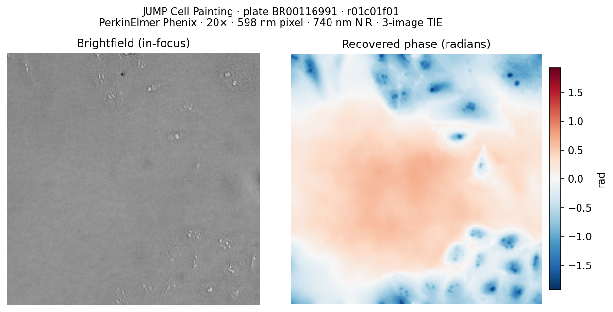

# US_TIE_Zhang_et_al_2020_py

**Quantitative phase imaging from brightfield microscopy images.**

`US_TIE_Zhang_et_al_2020_py` recovers the invisible *optical phase* of a specimen from a small set of conventional brightfield images taken at slightly different focus positions.
No fluorescence labels, no special optics, no pre-computation required — just your images and a few physical parameters.

---

## Origin and attribution

This package is a **Python adaptation of the MATLAB reference implementation** published by:

> Zheng, G., Horstmeyer, R., & Yang, C. (2020).
> "On a universal solution to the transport-of-intensity equation."
> *Optics Letters*, 45(7), 1607–1610.
> [arXiv:1912.07371](https://arxiv.org/abs/1912.07371)

The original MATLAB code was released by Zheng et al. under the [Creative Commons Attribution 4.0 International License (CC BY 4.0)](https://creativecommons.org/licenses/by/4.0/).
This Python adaptation is likewise released under CC BY 4.0.

**How the codebase was built:**
The MATLAB source was translated into Python and restructured as an installable package using **[Claude Sonnet 4.6](https://www.anthropic.com/claude)** (Anthropic).
During that process the implementation was extended with a DCT/Neumann boundary-condition solver, a full pytest suite (82 tests), Sphinx documentation, and a tutorial notebook using real [JUMP Cell Painting](https://registry.opendata.aws/cellpainting-gallery/) images.
All AI-generated code and documentation was reviewed by [Way Science Lab](https://www.waysciencelab.com).

If you use this package in your work, please cite the original paper (BibTeX at the bottom of this page).

---

## Why would I want the "phase"?

When light travels through a transparent object — a living cell, a thin polymer film, a glass bead — the light is not absorbed, so the image looks nearly uniform and featureless.
But the object does slow the light down slightly, changing its *phase*: the waves arrive at your camera a little delayed compared to waves that travelled through empty space.

This delay is proportional to the specimen's **optical path length** (thickness × refractive index), so the phase image is essentially a topographic map of the specimen.
It gives you:

- **Dry mass** of cells and organelles (from the mean phase signal)
- **Morphology** of transparent structures invisible in normal brightfield
- **Refractive index** when sample thickness is independently known
- **Label-free time-lapse** imaging without phototoxicity

Most cameras measure *intensity* (brightness), not phase.
`US_TIE_Zhang_et_al_2020_py` bridges this gap using the **Transport-of-Intensity Equation (TIE)**, a physical relationship that connects the small brightness changes you see when you deliberately defocus your microscope to the underlying phase structure.

---

## How does it work?

### The short version

1. Take 2 or 3 brightfield images at slightly different focus positions.
2. The brightness differences between those images carry information about the phase.
3. `US_TIE_Zhang_et_al_2020_py` solves the TIE to extract the phase from those differences.

### A little more detail

The **Transport-of-Intensity Equation** is:

```
k · ∂I/∂z  =  −∇ · [I(r) ∇φ(r)]
```

where `k = 2π/λ` is the optical wavenumber, `I` is intensity, `φ` is the phase, and `z` is the axial (focus) direction.
In plain terms: the rate at which brightness changes as you move through focus is determined by the spatial gradients of the phase.

Solving this equation for `φ` is a **Poisson problem** — the same type of equation that governs heat flow, electrostatics, and fluid dynamics.
`US_TIE_Zhang_et_al_2020_py` implements the **Universal Solution to the TIE (US-TIE)** of Zheng et al. (2020), an iterative algorithm that solves this problem robustly even when the specimen has very different brightness across the field of view.

---

## Install

```bash
pip install US_TIE_Zhang_et_al_2020_py
```

**Development install**: this project is managed with [uv](https://docs.astral.sh/uv/).

```bash
git clone https://github.com/wayscience/US_TIE_Zhang_et_al_2020_py
cd US_TIE_Zhang_et_al_2020_py
uv sync --group dev
uv run pytest          # confirm all 82 tests pass
```

See [`CONTRIBUTING.md`](CONTRIBUTING.md) for the full development workflow.

**Requirements**: Python ≥ 3.10, NumPy ≥ 1.24, SciPy ≥ 1.10.

---

## Quick start

Three real brightfield images from the
[JUMP Cell Painting pilot dataset](https://registry.opendata.aws/cellpainting-gallery/)
(plate BR00116991, PerkinElmer Phenix, 20× objective) are included in `tests/data/`
as a ready-made example.

```python
import tifffile
from US_TIE_Zhang_et_al_2020_py import retrieve_phase, remove_piston

# Three z-planes acquired on a PerkinElmer Phenix: below focus, in-focus, above focus
I_under = tifffile.imread("tests/data/brightfield_under.tiff").astype(float)  # −4 µm
I_focus = tifffile.imread("tests/data/brightfield_focus.tiff").astype(float)  # in-focus
I_over  = tifffile.imread("tests/data/brightfield_over.tiff").astype(float)   # +7 µm

phase = retrieve_phase(
    images=[I_under, I_focus, I_over],
    dz=5.5e-6,         # half the total 11 µm span between outer planes
    pixelsize=5.98e-7, # 20× objective, 2×2 binning, Andor Zyla camera
    wavelength=740e-9, # NIR broadband illumination
)
phase = remove_piston(phase)  # subtract mean (Poisson solvers recover relative phase only)
```



*Left: in-focus brightfield. Right: recovered phase in radians — red regions are optically
denser than the surrounding medium (cells and organelles); blue is lighter.*

For a complete walkthrough — visualisation, physical units, 2-image vs 3-image comparison,
and batch processing — see **[`examples/tutorial.ipynb`](examples/tutorial.ipynb)**.

---

## Choosing a Poisson solver backend

`retrieve_phase` has a `solver` parameter that selects how the Poisson equation is solved.
The choice affects accuracy near image borders.

| `solver=` | Boundary condition | Best for |
|---|---|---|
| `'fft'` (default) | Periodic — the left edge is stitched to the right edge | Specimens well away from the border |
| `'dct'` | Neumann — no flux crosses the image border | Specimens near the border; eliminates boundary ringing |

```python
# Switch to Neumann (DCT) boundary conditions:
phase = retrieve_phase(
    images=[I_under, I_focus, I_over],
    dz=1e-6, pixelsize=162.5e-9, wavelength=532e-9,
    solver='dct',
)
```

---

## Batch processing and performance

### Speed

On a 512×512 image (Apple M-series, single call):

| `max_iter` | Time | Notes |
|---|---|---|
| 10 | ~150 ms | Converged in practice — adequate for interactive use |
| 50 | ~870 ms | Recommended default for publication-quality results |
| 500 | ~9 s | Factory default; usually far more iterations than needed |

The US-TIE algorithm converges in **5–10 iterations** on typical cell images.
The default `max_iter=500` is a conservative upper bound; reducing it to 50 gives a
6× speed-up with no measurable difference in the phase map.

```python
# Fast interactive run — converged in practice
phase = retrieve_phase(images, dz, pixelsize, wavelength, max_iter=10)

# Publication quality
phase = retrieve_phase(images, dz, pixelsize, wavelength, max_iter=50)
```

### Applying the solver to many images

When processing many images of the same size (e.g. a time-lapse movie), avoid constructing a new solver on every frame.
The `TIESolver` class precomputes frequency grids and filter kernels at construction and reuses them on every call:

```python
import numpy as np
from US_TIE_Zhang_et_al_2020_py import TIESolver

solver = TIESolver(
    shape=(512, 512),
    pixelsize=162.5e-9,
    k=2 * np.pi / 532e-9,
    backend='dct',
)

phases = [solver.solve(dIdz_t, I0_t, max_iter=50)['phase'] for dIdz_t, I0_t in frames]
```

### Multi-threading

`US_TIE_Zhang_et_al_2020_py` uses `scipy.fft` which automatically distributes FFT work across all CPU cores.
No extra configuration is needed.
To restrict to a single thread (e.g. for reproducible benchmarks), pass `fft_workers=1` to `TIESolver` or `retrieve_phase`.

---

## Key parameters explained

| Parameter | What it is | Typical value |
|---|---|---|
| `dz` | Axial distance between focus planes (metres) | 0.5 – 5 µm |
| `pixelsize` | Camera pixel size **at the sample** (metres) | Camera pixel / magnification |
| `wavelength` | Illumination wavelength (metres) | 405 – 660 nm for visible light |
| `reg` | Regularisation strength (FFT only) | `1e-16` (default) to `1e-3` |
| `max_iter` | Maximum US-TIE iterations | 10 (fast) – 50 (recommended) |

**Computing `pixelsize`**: divide your physical camera pixel size by the objective magnification.
For a 6.5 µm pixel camera and a 40× objective: `pixelsize = 6.5e-6 / 40 = 162.5e-9` m.

---

## Advanced usage

### Separating dIdz computation from solving

```python
from US_TIE_Zhang_et_al_2020_py import compute_dIdz, TIESolver
import numpy as np

# Step 1: compute the axial intensity derivative from images
dIdz, I0 = compute_dIdz([I_under, I_focus, I_over], dz=1e-6)

# Step 2: solve
solver = TIESolver(I0.shape, pixelsize=162.5e-9, k=2*np.pi/532e-9)
result = solver.solve(dIdz, I0)

phase = result['phase']
print(f"Converged in {result['iterations']} iterations")
```

### Removing the constant phase offset (piston)

Poisson-based solvers cannot determine the absolute phase level — only relative differences.
Use `remove_piston` to subtract the mean:

```python
from US_TIE_Zhang_et_al_2020_py import remove_piston
phase_centred = remove_piston(phase)
```

### Simulating defocused images (for testing)

```python
import numpy as np
from US_TIE_Zhang_et_al_2020_py import numerical_propagation

phi_true = np.zeros((256, 256))
phi_true[80:160, 80:160] = 1.5        # 1.5 rad square phase object
U0 = np.exp(1j * phi_true)             # unit amplitude, phase object

# Simulate what the camera sees at +2 µm defocus
_, I_over, _ = numerical_propagation(
    U0, dz=2e-6, pixelsize=162.5e-9, wavelength=532e-9
)
```

---

## Package layout

```
US_TIE_Zhang_et_al_2020_py/
├── pipeline.py     retrieve_phase, compute_dIdz          ← start here
├── solver.py       TIESolver                             ← reusable engine for batch/timelapse
├── algorithms.py   universal_solution, fft_tie_solution  ← same solvers, functional API
├── poisson.py      poisson_fft, poisson_dct              ← standalone Poisson math (∇²φ = f)
├── tie.py          tie_forward, tie_max_solver            ← TIE forward model and step operator
├── propagation.py  numerical_propagation                 ← simulate defocused images for testing
└── utils.py        remove_piston, rmse                   ← post-processing helpers
```

Most users only need `pipeline.py` (`retrieve_phase`) and optionally `solver.py` (`TIESolver`) for batch work.
The remaining modules are the mathematical building blocks used internally, exposed for advanced use.

---

## Reference

> Zheng, G., Horstmeyer, R., & Yang, C. (2020).
> "On a universal solution to the transport-of-intensity equation."
> *Optics Letters*, 45(7), 1607–1610.
> [arXiv:1912.07371](https://arxiv.org/abs/1912.07371)

---

## Attribution and license

This package is an adaptation of the MATLAB reference implementation released by Zheng et al. (2020) under the [Creative Commons Attribution 4.0 International License (CC BY 4.0)](https://creativecommons.org/licenses/by/4.0/).
This Python adaptation is likewise released under CC BY 4.0 — see [`LICENSE`](LICENSE) for the full text.

**What was changed from the original:**
the MATLAB source was translated into Python, restructured as an installable package, extended with a DCT/Neumann boundary-condition solver, and accompanied by a full test suite and documentation.

**AI assistance:** this adaptation was produced with the assistance of [Claude](https://claude.ai) (Anthropic).
All generated code and documentation was reviewed by Way Science Lab.

If you use `US_TIE_Zhang_et_al_2020_py` in your work, please cite the original paper:

```
Zheng, G., Horstmeyer, R., & Yang, C. (2020).
On a universal solution to the transport-of-intensity equation.
Optics Letters, 45(7), 1607–1610. https://arxiv.org/abs/1912.07371
```
